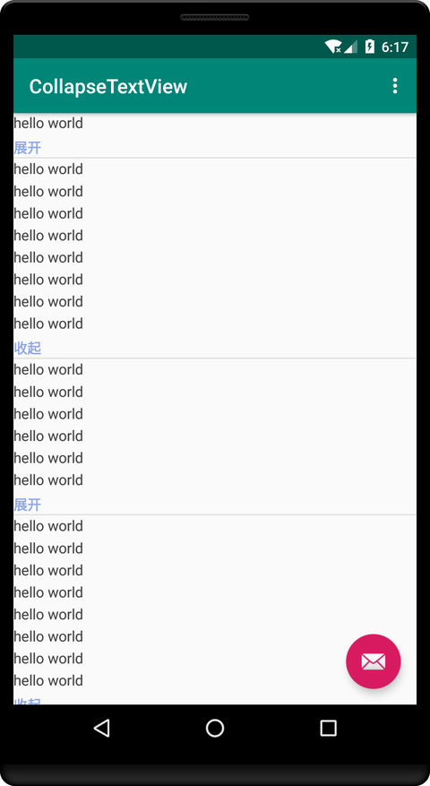

[](https://travis-ci.com/HawksJamesf/CollapseTextView)  [ ](https://bintray.com/makeyouflying/maven/com.hawksjamesf.library%3Acollapsetextview/_latestVersion)

<a href='https://bintray.com/makeyouflying/maven/com.hawksjamesf.library%3Acollapsetextview?source=watch' alt='Get automatic notifications about new "com.hawksjamesf.library:collapsetextview" versions'></a>

`good good study,day day up`

script:
- common.gradle：通用开发者库
- push_jfrog_maven.gradle：上传到jfrog bintray
- push_nexus_maven.gradle: 上传到nexus
- maven_push.sh:当本地版本更新，会自动上传library库到maven
## add dependencies
```xml
<dependency>
  <groupId>com.hawksjamesf.library</groupId>
  <artifactId>collapsetextview</artifactId>
  <version>1.0.0</version>
  <type>pom</type>
</dependency>
```
```compile 'com.hawksjamesf.library:collapsetextview:1.0.0'```


